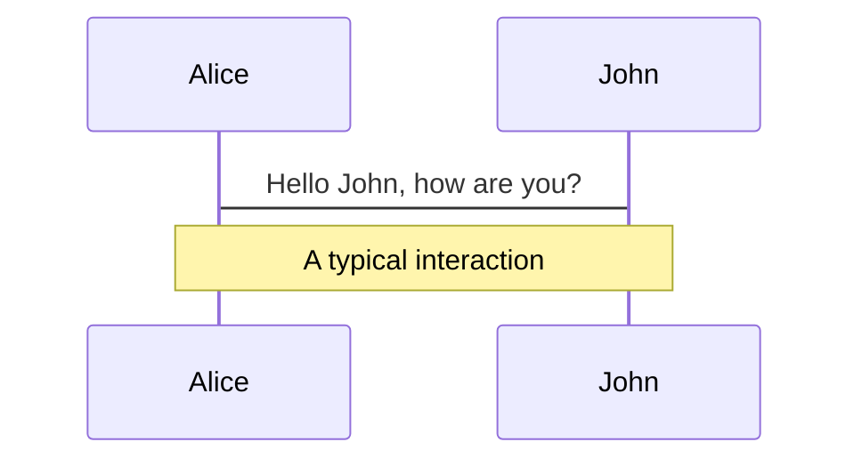
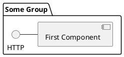

# Slidev Frontmatter 范式参考

基于 `slides_design_reference.md` 整理的完整 Frontmatter 配置参考，包含全局 Headmatter 和每页 Frontmatter 的所有用法。

## 目录

- [全局 Headmatter 配置](#全局-headmatter-配置)
- [每页 Frontmatter 配置](#每页-frontmatter-配置)
- [布局相关配置](#布局相关配置)
- [动画与过渡配置](#动画与过渡配置)
- [样式与类配置](#样式与类配置)
- [功能配置](#功能配置)
- [实际使用示例](#实际使用示例)

---

## 全局 Headmatter 配置

### 基础配置

```yaml
---
# 主题设置
theme: seriph                    # 主题名称：default, seriph 等

# 背景设置
background: https://cover.sli.dev # 背景图片 URL

# 标题与信息
title: Welcome to Slidev         # 演示标题
info: |                          # 演示描述信息（支持 Markdown）
  ## Slidev Starter Template
  Presentation slides for developers.
  Learn more at [Sli.dev](https://sli.dev)

# 样式类
class: text-center               # 应用到当前页的 UnoCSS 类

# 绘图功能
drawings:
  persist: false                 # 绘图是否持久化

# 过渡效果
transition: slide-left           # 页面过渡动画类型

# MDC 语法支持
mdc: true                        # 启用 MDC 语法

# SEO 元数据
seoMeta:
  ogImage: auto                  # Open Graph 图片设置
  # ogImage: https://cover.sli.dev

# 演示模式
presenter: true                  # 启用演示者模式

# Monaco 编辑器
monaco: true                     # 启用 Monaco 编辑器
monacoTypesSource: local         # Monaco 类型源

# 字体设置
fonts: { sans: Inter, mono: 'JetBrains Mono' }

# 颜色方案
colorSchema: auto                # 自动适应明暗主题

# 路由模式
routerMode: history              # 路由模式

# 宽高比
aspectRatio: 16/9                # 演示宽高比

# 画布宽度
canvasWidth: 980                 # 画布宽度

# 全局默认设置
defaults:
  layout: default                # 默认布局
  class: text-left max-w-4xl mx-auto leading-8  # 默认样式类
---
```

---

## 每页 Frontmatter 配置

### 过渡动画配置

```yaml
---
transition: fade-out             # 淡出过渡
---

---
transition: slide-up             # 向上滑动过渡
level: 2                         # 目录层级
---
```

### 布局配置

```yaml
---
layout: two-cols                 # 两列布局
layoutClass: gap-16             # 列间距
---

---
layout: image-right              # 右侧图片布局
image: https://cover.sli.dev    # 右侧图片
---

---
layout: center                   # 居中布局
class: text-center               # 居中对齐
---
```

### 样式类配置

```yaml
---
class: px-20                     # 左右内边距 20
---

---
class: text-center               # 文本居中
---
```

### 功能配置

```yaml
---
src: ./pages/imported-slides.md  # 导入外部文件
hide: false                      # 是否隐藏
---

---
foo: bar                         # 自定义属性
dragPos:                         # 拖拽位置配置
  square: 691,32,167,_,-16
---
```

---

## 布局相关配置

### 两列布局

```yaml
---
layout: two-cols
layoutClass: gap-16
---

# 左列内容
::right::

# 右列内容
```

### 图片布局

```yaml
---
layout: image-right
image: https://example.com/image.jpg
---

# 左侧内容
# 右侧自动显示图片
```

### 居中布局

```yaml
---
layout: center
class: text-center
---

# 居中显示的内容
```

---

## 动画与过渡配置

### 过渡类型

- `slide-left` - 向左滑动
- `slide-right` - 向右滑动
- `slide-up` - 向上滑动
- `slide-down` - 向下滑动
- `fade-out` - 淡出
- `fade-in` - 淡入

### 点击动画

```html
<!-- 基础点击动画 -->
<div v-click>点击后显示的内容</div>

<!-- 带编号的点击动画 -->
<div v-click="1">第一步显示</div>
<div v-click="2">第二步显示</div>

<!-- 标记动画 -->
<span v-mark.red="3">红色标记</span>
<span v-mark.circle.orange="4">橙色圆圈标记</span>
```

### 运动动画

```html
<div
  v-motion
  :initial="{ x: -80 }"
  :enter="{ x: 0 }"
  :click-3="{ x: 80 }"
  :leave="{ x: 1000 }"
>
  运动内容
</div>
```

---

## 样式与类配置

### UnoCSS 类

```yaml
---
class: text-center max-w-4xl mx-auto leading-8
---
```

常用类组合：
- `text-center` - 文本居中
- `text-left` - 文本左对齐
- `max-w-4xl` - 最大宽度
- `mx-auto` - 水平居中
- `leading-8` - 行高
- `px-20` - 左右内边距
- `space-y-4` - 垂直间距

### 自定义样式

```html
<style>
h1 {
  background-color: #2B90B6;
  background-image: linear-gradient(45deg, #4EC5D4 10%, #146b8c 20%);
  background-size: 100%;
  -webkit-background-clip: text;
  -moz-background-clip: text;
  -webkit-text-fill-color: transparent;
  -moz-text-fill-color: transparent;
}
</style>
```

---

## 功能配置

### Monaco 编辑器

```ts {monaco}
// 可编辑的代码块
import { ref } from 'vue'
const count = ref(0)
```

```ts {monaco-run}
// 可执行的代码块
import { version } from 'vue'
console.log(`vue ${version}`)
```

### 图表支持





### LaTeX 支持

```latex
Inline $\sqrt{3x-1}+(1+x)^2$

Block
$$ {1|3|all}
\begin{aligned}
\nabla \cdot \vec{E} &= \frac{\rho}{\varepsilon_0}
\end{aligned}
$$
```

---

## 实际使用示例

### 封面页配置

```yaml
---
theme: seriph
background: https://cover.sli.dev
title: 我们的 AI 课程
info: |
  ## AI 能力与边界
  使用 Slidev 官方主题与交互能力
class: text-center
transition: slide-left
mdc: true
presenter: true
monaco: true
fonts: { sans: Inter, mono: 'JetBrains Mono' }
colorSchema: auto
defaults:
  layout: default
  class: text-left max-w-[56ch] mx-auto leading-9
---
```

### 内容页配置

```yaml
---
layout: default
class: text-left max-w-[56ch] mx-auto leading-9
---

# 页面标题
内容...
```

### 两列对比页

```yaml
---
layout: two-cols
layoutClass: gap-16
---

# 左列标题
左列内容

::right::

# 右列标题
右列内容
```

### 图片展示页

```yaml
---
layout: image-right
image: /path/to/image.jpg
---

# 内容标题
相关说明文字
```

---

## 最佳实践

1. **全局配置**：在 `slides.md` 顶部设置全局 Headmatter
2. **页面配置**：每页使用简洁的 Frontmatter，只设置必要的属性
3. **样式统一**：通过 `defaults.class` 设置全局样式，页面级别只覆盖必要的样式
4. **布局选择**：根据内容类型选择合适的布局（`default`、`center`、`two-cols`、`image-right`）
5. **动画适度**：合理使用过渡和点击动画，避免过度动画影响内容理解

---

## 参考链接

- [Slidev 官方文档](https://sli.dev)
- [主题画廊](https://sli.dev/resources/theme-gallery)
- [UnoCSS 文档](https://unocss.dev)
- [Vue 3 文档](https://vuejs.org)
