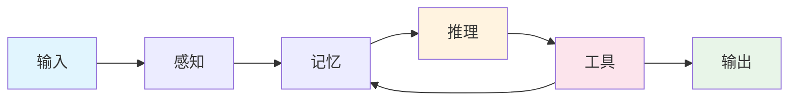
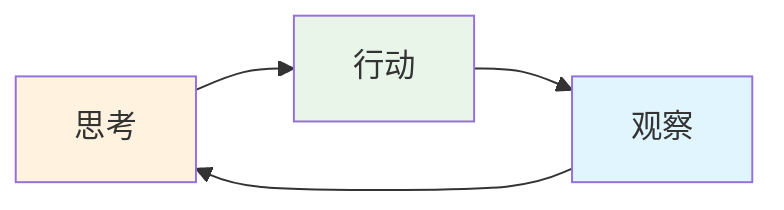

# 深入理解 AI Agent
让你的AI更"聪明"地思考和行动

<div class="mt-12">
  <div class="text-6xl mb-8">🤖</div>
  <div class="text-2xl text-gray-600 mb-8">
    第四课 · AI Agent 架构与实战
  </div>
</div>

<div class="absolute bottom-10 left-0 right-0">
  <div @click="$slidev.nav.next" class="inline-flex items-center gap-2 px-6 py-3 rounded-full bg-primary/10 hover:bg-primary/20 transition-colors cursor-pointer">
    <span class="text-lg">开始学习</span>
    <carbon:arrow-right class="text-xl" />
  </div>
  
  <p class="mt-4 text-sm text-gray-500">
    按 <kbd class="px-2 py-1 rounded bg-gray-200">空格</kbd> 或点击继续
  </p>
</div>

<!--
演讲者笔记：
- 欢迎学员进入第四课
- 简单介绍今天的主题：AI Agent
- 营造学习氛围
-->

---
layout: center
class: text-left max-w-[56ch] mx-auto leading-10 space-y-6
---

<script setup>
// Import components for interactive demonstrations
import AgentDemo from '../components/AgentDemo.vue'
import ReActExample from '../components/ReActExample.vue'
import GeminiAgentModal from '../components/GeminiAgentModal.vue'
</script>

# 课程概览

**90分钟理论与实战结合课程**
从基础概念到 ReAct 模式，再到 Gemini 实际演示

<div class="mt-8 space-y-4">

* 🎯 **目标**：深度理解 AI Agent 原理 + 掌握**ReAct 思维模式**的实际应用
* 👥 **受众**：想要构建智能应用的开发者和产品人  
* ⏱️ **时间**：理论基础45分钟 + Gemini实战40分钟 + 总结回顾5分钟
* 🔥 **重点**：概念厘清 + 模式理解 + 实际操作

</div>

---
layout: section
class: text-center
---

# 开场热身
让我们了解你对 AI Agent 的认知

---
class: text-left max-w-[60ch] mx-auto leading-8 space-y-6
---

## 🙋‍♀️ 快速调研（举手/发言）

<v-clicks>

* **什么是 AI Agent？**  
  <span class="text-sm opacity-75">（请用自己的理解简单描述）</span>

* **相比原生 LLM 的推理，Agent 能带来了哪些能力？**  
  <span class="text-sm opacity-75">（想想 ChatGPT 和智能助手的区别）</span>

* **为什么 Agent 需要具备这些能力？**  
  <span class="text-sm opacity-75">（从实际应用场景考虑）</span>

* **你最希望 AI Agent 帮你解决什么问题？**  
  <span class="text-sm opacity-75">（工作中的具体痛点或需求）</span>

</v-clicks>

<div v-click class="mt-8 p-4 bg-blue-50 rounded-lg border-l-4 border-blue-400">
💡 <strong>目的</strong>：建立对 AI Agent 的直观认知，为深入学习做准备
</div>

---
layout: section
class: text-center
---

# Part 1: AI Agent 的本质
从概念到架构的全面解析（30分钟）

---
layout: two-cols
layoutClass: gap-6
class: text-left leading-7
---

## 🤔 引言：ChatGPT 很强大，但它有什么"局限"？

<v-clicks>

### ✅ LLM 的强大能力
LLM 能理解人类语言，生成文本，回答问题，进行复杂的逻辑推理

### ⚠️ LLM 的核心局限
LLM 是一个 <span v-mark.underline.orange>"被动的推理引擎"</span>

无法：
- **感知外部环境**：不知道电脑文件，看不到网页内容
- **改变外部环境**：无法执行命令、保存文件、点击按钮

</v-clicks>

::right::

<div v-click>

### 🧠 形象类比

<div class="space-y-4">
  <div class="p-4 bg-gray-50 rounded-lg border">
    <div class="text-center mb-3">
      <div class="text-4xl mb-2">🧠</div>
      <div class="font-semibold text-gray-700">传统 LLM</div>
    </div>
    <div class="space-y-2 text-sm">
      <div class="flex items-center gap-2">
        <span class="text-green-500">✅</span>
        <span>强大的"大脑"</span>
      </div>
      <div class="flex items-center gap-2">
        <span class="text-red-500">❌</span>
        <span>缺少"感官"</span>
      </div>
      <div class="flex items-center gap-2">
        <span class="text-red-500">❌</span>
        <span>缺少"四肢"</span>
      </div>
    </div>
  </div>
  <div class="p-4 bg-blue-50 rounded-lg border border-blue-200">
    <div class="text-center mb-3">
      <div class="text-4xl mb-2">🤖</div>
      <div class="font-semibold text-blue-700">AI Agent</div>
    </div>
    <div class="space-y-2 text-sm">
      <div class="flex items-center gap-2">
        <span class="text-green-500">✅</span>
        <span>智能"大脑"</span>
      </div>
      <div class="flex items-center gap-2">
        <span class="text-green-500">✅</span>
        <span>配备"感官"</span>
      </div>
      <div class="flex items-center gap-2">
        <span class="text-green-500">✅</span>
        <span>拥有"四肢"</span>
      </div>
    </div>
  </div>
</div>

</div>

<blockquote v-click class="mt-6 p-3 bg-gradient-to-r from-blue-50 to-green-50 rounded border-l-4 border-blue-400 text-sm">
<strong>这就是为什么我们需要 AI Agent</strong> —— 给 AI 装上"感官"和"四肢"！
</blockquote>

<!--
演讲者笔记：
- 先让学员认识到现有AI的局限性
- 用生动的比喻帮助理解
- 为引入Agent概念做铺垫
-->

---
layout: section
class: text-center
---

# 那么，什么是 AI Agent？

---
layout: two-cols
layoutClass: gap-8
class: text-left max-w-[60ch] mx-auto leading-8 space-y-6
---

## 🤖 什么是 AI Agent？

<v-clicks>

### 📖 定义解析

**AI Agent = 能够感知环境、做出决策、执行行动的智能体**

- **感知（Perception）**：理解输入信息和当前状态
- **决策（Decision）**：基于目标和策略进行推理
- **行动（Action）**：执行具体操作并产生结果

### 🧠 核心特征

1. **自主性**：能独立完成任务，不需要每步指导
2. **目标导向**：明确知道要达成什么目标
3. **环境感知**：能理解和适应变化的环境
4. **学习能力**：从经验中改进表现

</v-clicks>

::right::

<div v-click>

## 🔍 Agent vs LLM的区别

### 基础 LLM 
- **被动响应**：等待用户输入
- **单轮交互**：一问一答模式
- **无状态**：不记住历史context
- **工具依赖**：需要人工调用外部工具

### AI Agent
- **主动思考**：会分析问题并制定计划
- **多轮推理**：能进行复杂的思维链
- **状态管理**：保持记忆和上下文
- **工具集成**：自主选择和使用工具

</div>

---
layout: center
class: text-center
---

<div class="mt-8">
  <div class="flex justify-center">
    
  </div>
</div>

<div v-click class="mt-6 text-center">
  <div class="text-lg text-gray-600 mb-2">LLM 驱动下的 AI Agents System 概览</div>
  <div class="text-sm text-gray-500">Lilian Weng - OpenAI 研究科学家提出的经典架构图</div>
</div>

<div v-click class="mt-4 p-4 bg-blue-50 rounded-lg max-w-3xl mx-auto border-l-4 border-blue-400">
  <p class="text-sm text-gray-700">
    💡 <strong>核心洞察</strong>：这是 AI Agent 领域最具影响力的架构图之一，清晰展示了 Planning、Memory 和 Tool Use 三大核心模块如何围绕 LLM 协同工作
  </p>
</div>

---
layout: center
class: text-center
---

# 🏗️ AI Agent 的基础架构

<div class="mt-6">
<div class="flex justify-center">
<div class="bg-gray-50 rounded-lg p-6 max-w-4xl w-full">



</div>
</div>
</div>

<div v-click class="mt-4 grid grid-cols-4 gap-4 max-w-4xl mx-auto text-sm">
  <div class="text-center p-3 bg-blue-50 rounded">
    <div class="font-semibold text-blue-700">感知模块</div>
    <div class="text-gray-600 mt-1">理解输入信息</div>
  </div>
  <div class="text-center p-3 bg-purple-50 rounded">
    <div class="font-semibold text-purple-700">记忆模块</div>
    <div class="text-gray-600 mt-1">存储上下文</div>
  </div>
  <div class="text-center p-3 bg-orange-50 rounded">
    <div class="font-semibold text-orange-700">推理引擎</div>
    <div class="text-gray-600 mt-1">制定计划</div>
  </div>
  <div class="text-center p-3 bg-pink-50 rounded">
    <div class="font-semibold text-pink-700">工具接口</div>
    <div class="text-gray-600 mt-1">执行操作</div>
  </div>
</div>

---
layout: two-cols
layoutClass: gap-6
class: text-left max-w-[60ch] mx-auto leading-8 space-y-6
---

## 🧩 Agent 架构的核心组件

<v-clicks>

### 1. **感知模块（Perception）**
- 文本理解：解析用户意图和指令
- 多模态输入：处理图像、音频等
- 环境状态：获取当前上下文

### 2. **记忆模块（Memory）**
- 短期记忆：当前对话的上下文
- 长期记忆：用户偏好、历史交互
- 工作记忆：当前任务的临时信息

</v-clicks>

::right::

<v-clicks>

### 3. **推理引擎（Reasoning）**
- 计划制定：将复杂任务分解为子步骤
- 策略选择：从多个方案中选择最优路径
- 因果推理：理解行动与结果的关系

### 4. **工具接口（Tools）**
- 搜索引擎：获取实时信息
- 计算器：进行数学运算
- API调用：连接外部服务
- 代码执行：运行程序脚本

</v-clicks>

<div v-click class="mt-6 p-3 bg-blue-50 rounded border-l-4 border-blue-400 text-sm">
💡 <strong>关键</strong>：四个模块协同工作，形成智能决策闭环
</div>

---
layout: section
class: text-center
---

# 🧠 深入理解：决策/推理引擎
Agent 的"大脑"如何工作

---
layout: center
class: text-center
---

# 📋 推理引擎的整体框架

<div class="mt-8 max-w-5xl mx-auto">
  <div class="grid grid-cols-1 md:grid-cols-2 gap-8">
    <div class="bg-blue-50 rounded-lg p-6 border border-blue-200">
      <div class="text-center mb-4">
        <div class="text-4xl mb-2">📊</div>
        <h3 class="text-xl font-semibold text-blue-800">Planning / 事前规划</h3>
      </div>
      <div class="space-y-3 text-sm text-left">
        <div class="bg-white rounded p-3">
          <div class="font-semibold text-blue-700">🔗 Chain of Thought (CoT)</div>
          <div class="text-gray-600">逐步推理，线性思考过程</div>
        </div>
        <div class="bg-white rounded p-3">
          <div class="font-semibold text-green-700">🌳 Tree of Thought (ToT)</div>
          <div class="text-gray-600">多分支探索，并行评估方案</div>
        </div>
        <div class="bg-white rounded p-3">
          <div class="font-semibold text-purple-700">🎯 任务分解</div>
          <div class="text-gray-600">复杂问题拆解为子任务</div>
        </div>
      </div>
    </div>
    <div class="bg-orange-50 rounded-lg p-6 border border-orange-200">
      <div class="text-center mb-4">
        <div class="text-4xl mb-2">🔄</div>
        <h3 class="text-xl font-semibold text-orange-800">Self-Reflection / 事后反思</h3>
      </div>
      <div class="space-y-3 text-sm text-left">
        <div class="bg-white rounded p-3">
          <div class="font-semibold text-orange-700">🔄 ReAct 模式</div>
          <div class="text-gray-600">推理+行动的动态循环</div>
        </div>
        <div class="bg-white rounded p-3">
          <div class="font-semibold text-red-700">🧘 Reflexion 框架</div>
          <div class="text-gray-600">深度自我反思和记忆改进</div>
        </div>
        <div class="bg-white rounded p-3">
          <div class="font-semibold text-indigo-700">🔍 策略调整</div>
          <div class="text-gray-600">基于反馈优化执行路径</div>
        </div>
      </div>
    </div>
  </div>
</div>

<div v-click class="mt-6 p-4 bg-gradient-to-r from-blue-50 to-orange-50 rounded-lg border border-gray-200 max-w-4xl mx-auto">
  <p class="text-center text-gray-700">
    💡 <strong>核心理念</strong>：事前规划制定策略，事后反思优化执行，两者结合形成完整的智能决策系统
  </p>
</div>

---
layout: section
class: text-center
---

# 📊 事前规划：思维链技术
制定策略的核心方法

---
layout: two-cols
layoutClass: gap-6
class: text-left leading-7
---

## 🔗 Chain of Thought (CoT)

<v-clicks>

### 🎯 **核心理念**
逐步展示推理过程，让 AI “显性思考”

### 📝 **经典示例**
```
问题：如果一个披萨8片，3个人分，每人能分多少？

CoT 推理过程：
1. 总共8片披萨
2. 3个人平分
3. 8 ÷ 3 = 2.67片
4. 每人可分到约2片，剩余2片
```

### ✅ **优势**
- 推理过程透明可见
- 适合线性逻辑问题
- 容易理解和调试

</v-clicks>

::right::

## 🌳 Tree of Thought (ToT)

<v-clicks>

### 🎯 **核心理念**
探索多种可能的解决路径，并行评估和选择

### 📝 **实际应用**
```
问题：如何提高产品销量？

ToT 多路径探索：
│
├── 路径A：传统广告投放
│     ┗─ 成本高，覆盖面广
│
├── 路径B：社交媒体营销
│     ┗─ 成本低，传播精准
│
┗── 路径C：合作伙伴渠道
      ┗─ 共享资源，互利共赢

评估：选择 B+C 组合方案
```

### ✅ **优势**
- 全面考虑多种可能
- 避免局部最优解
- 适合复杂决策问题

</v-clicks>

---
layout: section
class: text-center
---

# 🔄 事后反思：自我进化技术
介错而改的智能机制

---
layout: two-cols
layoutClass: gap-6
class: text-left leading-7
---

## 🔄 ReAct 框架

<v-clicks>

### 🎯 **核心理念**
Reasoning + Acting 的动态循环



### 📝 **工作流程**
```
Thought: 用户问股价，需要实时数据
Action: get_stock_price("AAPL")
Observation: 苹果股价 $195.32
Thought: 现在可以给出完整回答
Action: 生成用户友好的回复
```

### ✅ **优势**
- 实时获取反馈
- 动态调整策略
- 错误及时纠正

</v-clicks>

::right::

## 🧘 Reflexion 框架

<v-clicks>

### 🎯 **核心理念**
深度自我反思和记忆改进

### 📝 **工作机制**
```
1. 执行任务
2. 评估结果
3. 识别问题和错误
4. 存储经验教训
5. 更新策略和行为模式
```

### 📊 **与 ReAct 对比**
- **ReAct**: 即时反馈，实时调整
- **Reflexion**: 累积学习，长期优化

### ✅ **优势**
- 从失败中学习
- 持续性能提升
- 适合复杂长期任务

</v-clicks>

<div v-click class="mt-4 p-3 bg-green-50 rounded border-l-4 border-green-400 text-sm">
💡 <strong>实战预告</strong>：ReAct 模式将在 Part 2 中详细演示和实践
</div>

---
layout: section
class: text-center
---

# 🛠️ 深入理解：工具接口
Agent 的"手脚"如何延伸

---
layout: default
class: text-left leading-7
---

# 🤔 为什么 Agent 需要工具？

<v-clicks>

### 🧠 **LLM 的固有局限**
- **知识截止日期**：无法获取最新信息
- **计算能力限制**：复杂数学运算容易出错
- **无法执行操作**：不能直接修改文件、发送邮件
- **缺乏实时数据**：无法访问股价、天气等动态信息

### 🔧 **工具的核心作用**
```
没有工具的AI："我不知道今天的天气，因为我的知识更新到..."

有工具的Agent：
1. 调用天气API获取实时数据
2. 分析数据并生成个性化建议
3. "北京今天晴，22°C，建议穿轻薄外套"
```

### 🌟 **工具让 AI 变成真正的助手**
从"知识问答机器"升级为"能干事的智能助手"

</v-clicks>

---
layout: section
class: text-center
---

# 🎯 工具决策机制
Agent 如何决定何时、如何使用工具？

---
layout: two-cols
layoutClass: gap-6
class: text-left leading-7
---

## 🧩 工具决策的核心机制

<v-clicks>

### 🎯 **LLM 作为决策核心**
通过 Prompt Engineering 训练 LLM：
- 理解何时需要工具
- 选择正确的工具
- 生成合适的参数

```
系统提示："当用户询问实时信息时，
使用 search_web() 工具获取最新数据"

用户："苹果股价多少？"
Agent：调用 get_stock_price("AAPL")
```

### 📋 **工具描述的重要性**
```json
{
  "name": "search_web",
  "description": "搜索最新网络信息",
  "parameters": {
    "query": "搜索关键词",
    "lang": "语言代码(zh/en)"
  }
}
```

</v-clicks>

::right::

<v-clicks>

### 🔄 **ReAct 框架中的工具调用**
在"Action"步骤明确输出：
```
Thought: 用户问股价，需要实时数据
Action: get_stock_price("AAPL")
Observation: 苹果股价 $195.32
Thought: 现在可以给出完整回答
```

### 🌟 **Function Calling 示例**
```python
# OpenAI Function Calling
response = client.chat.completions.create(
  model="gpt-4",
  messages=[{"role": "user", "content": "查询天气"}],
  functions=[
    {
      "name": "get_weather",
      "description": "获取指定城市天气",
      "parameters": {
        "type": "object",
        "properties": {
          "city": {"type": "string"}
        }
      }
    }
  ]
)
```

</v-clicks>

---
layout: center
class: text-center
---

# 🔗 MCP：模型上下文协议
**Model Context Protocol - 工具集成的新标准**

<div class="mt-8 max-w-4xl mx-auto">
  <div class="bg-gradient-to-r from-blue-50 to-purple-50 rounded-lg p-6 border border-blue-200">
    <h3 class="text-xl font-semibold text-blue-800 mb-4">🚀 什么是 MCP？</h3>
    <div class="grid grid-cols-1 md:grid-cols-2 gap-6 text-left">
      <div>
        <h4 class="font-semibold text-blue-700 mb-2">📖 定义</h4>
        <p class="text-sm text-gray-700">由 Anthropic 提出的开放标准，旨在标准化 AI 模型与外部工具/数据源的连接方式</p>
      </div>
      <div>
        <h4 class="font-semibold text-purple-700 mb-2">🎯 目标</h4>
        <p class="text-sm text-gray-700">让不同的 AI 模型能够无缝连接各种工具，避免重复开发，提高互操作性</p>
      </div>
    </div>
  </div>
</div>

<div v-click class="mt-6 grid grid-cols-1 md:grid-cols-3 gap-4 max-w-4xl mx-auto text-sm">
  <div class="bg-green-50 rounded p-4 border border-green-200">
    <div class="font-semibold text-green-700">✅ 标准化接口</div>
    <div class="text-gray-600 mt-1">统一的工具描述和调用格式</div>
  </div>
  <div class="bg-blue-50 rounded p-4 border border-blue-200">
    <div class="font-semibold text-blue-700">🔗 跨平台兼容</div>
    <div class="text-gray-600 mt-1">不同 AI 服务商都能使用</div>
  </div>
  <div class="bg-purple-50 rounded p-4 border border-purple-200">
    <div class="font-semibold text-purple-700">🚀 生态发展</div>
    <div class="text-gray-600 mt-1">促进工具生态系统繁荣</div>
  </div>
</div>

<div v-click class="mt-6 p-4 bg-yellow-50 rounded-lg border-l-4 border-yellow-400 max-w-3xl mx-auto">
  <p class="text-sm text-gray-700">
    💡 <strong>未来趋势</strong>：MCP 有望成为 AI Agent 工具集成的行业标准，简化开发流程，提高工具复用性
  </p>
</div>

---
layout: section
class: text-center
---

# 🚨 当前 AI Agent 的能力边界

---
layout: two-cols
layoutClass: gap-6
class: text-left leading-7
---

## ✅ 目前能做好的事情

<v-clicks>

### 🎯 信息处理与分析
- 文档总结和信息提取
- 数据分析和可视化

### 🔧 工具集成与自动化
- 搜索信息并整合答案
- 调用API获取实时数据

### 💭 结构化推理
- 逐步分解复杂问题
- 按照既定流程执行任务

### 🎨 创意生成
- 文案写作和内容创作
- 代码生成和调试

</v-clicks>

::right::

## Agent 体验推荐

<v-clicks>

### 🎯 智能助手 : ChatGPT / GenSpark
- 智能助手、知识库问答、通用型

### 🎯生成式 UI : Gemini Build
- 直接带 UI/UX 的 APP

### 🎯 写代码 : ClaudeCode / Qoder 
- Vibe Coding、部署代码

### 🎯工作流 n8n/Dify
- 完成复杂任务

### 🎯DeepResearch / NotebookLM
- 知识获取、整合、撰写

</v-clicks>

---
layout: two-cols
layoutClass: gap-6
class: text-left leading-7
---

## ⚠️ 仍然存在的局限

<v-clicks>

### 🧠 推理局限
- **长期规划能力有限**：难以处理需要数天/数周的复杂项目
- **因果推理不稳定**：在复杂逻辑链中容易出错
- **创新思维受限**：主要基于训练数据的模式匹配

### 🔄 执行局限  
- **错误恢复能力弱**：遇到异常情况时难以自主调整
- **工具使用不够灵活**：对新工具或复杂工具链适应性差
- **状态管理复杂**：在多步骤任务中容易丢失上下文

</v-clicks>

::right::

<v-clicks>

### 🎯 目标理解局限
- **隐含需求识别**：难以理解用户的潜在意图
- **价值判断缺失**：无法进行道德或伦理层面的判断
- **个性化程度低**：难以深度适应个人偏好和工作方式

</v-clicks>

---
layout: section
class: text-center
---

# Part 2: ReAct 模式深度解析
推理与行动的完美结合（25分钟）

---
layout: two-cols   
class: text-left max-w-[56ch] mx-auto leading-10 space-y-8
---

## 🔄 ReAct 模式简介


**ReAct = Reasoning + Acting**

### 核心思想
将**推理**（Reasoning）和**行动**（Acting）交替进行，形成动态的思考-行动循环

### 传统方式 vs ReAct
- **传统**：思考完 → 一次性行动
- **ReAct**：思考 → 行动 → 观察 → 再思考 → 再行动


::right::

### 为什么有效？
1. **实时反馈**：每次行动后都能获得新信息
2. **错误纠正**：发现问题时可以及时调整策略
3. **动态规划**：根据实际情况调整后续步骤


---
layout: two-cols
class: text-left max-w-[65ch] mx-auto leading-8 space-y-6
---

## 🛠️ ReAct 模式的工作流程


### 1. **Thought（思考）**
分析当前状态，制定下一步计划
```
思考：用户询问北京明天的天气，我需要获取实时天气信息
```

### 2. **Action（行动）** 
选择合适的工具或操作
```
行动：调用天气API search_weather("北京", "明天")
```

### 3. **Observation（观察）**
获取行动结果，更新当前状态
```
观察：API返回数据 - 北京明天晴，15-25°C，轻微西风
```

::right::

### 4. **Thought（再思考）**
基于新信息规划下一步
```
思考：已获得天气信息，现在可以给用户一个完整的回答
```

### 5. **Action（最终回答）**
```
行动：根据数据生成用户友好的回答
```

<div class="mt-8 max-w-4xl mx-auto">

<GeminiAgentModal />

</div>


<div v-click class="mt-6 p-4 bg-green-50 rounded-lg border-l-4 border-green-400">
💡 <strong>关键</strong>：每个循环都基于最新信息进行决策，保证决策的准确性和适应性
</div>

---
layout: section
class: text-center
---

# Part 3: Gemini Agent 实战演示
从理论到实践的完整演练（10分钟）


---
layout: center
class: text-center
---

# 🎯 实战演示：智能研究助手

https://peng.craft.me/BZrxoPPwmt6ZeY

<div v-click class="mt-6 text-lg text-gray-600">
点击上方按钮查看完整的 ReAct 模式演示
</div>

---
layout: section
class: text-center
---

# 🔧 动手实践：构建你的第一个 Agent

---
layout: default
class: text-left max-w-[65ch] mx-auto leading-8 space-y-6
---

## 🎯 实践任务：个人学习助手

<v-clicks>

### 📋 任务目标
创建一个能够帮助用户制定学习计划并跟踪进度的AI Agent

### 🛠️ 需要实现的功能
1. **学习目标分析**：将大目标分解为可执行的小任务
2. **资源推荐**：根据学习内容推荐合适的学习资料
3. **进度跟踪**：记录学习进度并提供反馈
4. **知识测验**：生成测试题检验学习效果

### 🔧 工具函数设计
```python
def analyze_learning_goal(goal: str) -> dict:
    """分析学习目标并分解任务"""
    
def recommend_resources(topic: str, level: str) -> list:
    """推荐学习资源"""
    
def track_progress(user_id: str, completed_tasks: list) -> dict:
    """跟踪学习进度"""
    
def generate_quiz(topic: str, difficulty: str) -> dict:
    """生成测验题目"""
```

</v-clicks>

---
layout: two-cols
layoutClass: gap-8
class: text-left
---

## 📝 实践步骤指导

### 第1步：设计系统提示词
```
你是一个专业的学习助手，能够：
1. 使用ReAct模式制定学习计划
2. 推荐合适的学习资源
3. 跟踪用户学习进度
4. 生成个性化测验

请始终按照以下模式工作：
- Thought: 分析用户需求
- Action: 选择合适的工具
- Observation: 处理工具返回结果
- 重复直到完成任务
```

### 第2步：配置工具函数
在 Gemini AI Studio 中添加自定义函数

### 第3步：测试对话流程
验证 ReAct 模式是否正常工作

::right::

### 第4步：优化和调试
根据测试结果改进提示词和函数

### 🎯 预期效果
```
用户：我想学习Python编程
Agent：
Thought: 用户想学Python，需要分析目标并制定计划
Action: analyze_learning_goal("Python编程")
Observation: 分解为基础语法、数据结构、项目实践等
Thought: 现在推荐学习资源
Action: recommend_resources("Python基础", "初学者")
...
```

<div class="mt-6 p-4 bg-blue-50 rounded-lg border-l-4 border-blue-400 text-sm">
💡 <strong>提示</strong>：从简单功能开始，逐步增加复杂性
</div>

---
layout: section
class: text-center
---

# 📊 课程总结与展望

---
layout: default
class: text-left max-w-[65ch] mx-auto leading-8 space-y-6
---

## 🎯 今天你学到了什么？

<v-clicks>

### 1. **AI Agent 的本质理解**
- Agent = 感知 + 决策 + 行动的智能循环
- 与传统AI的核心区别：主动性和工具集成能力
- 架构组件：感知、记忆、推理、工具四大模块

### 2. **ReAct 模式的深度掌握**
- Reasoning + Acting 的交替循环
- 思考→行动→观察→再思考的工作流程
- 相比其他模式的优势：实时反馈和错误纠正

</v-clicks>

---
layout: two-cols
layoutClass: gap-8
class: text-left max-w-[60ch] mx-auto leading-8
---

## 🚀 进一步学习

### 🔧 技术提升
<v-clicks>

- **深入学习更多工具**：Dify、n8n 等
- **探索其他平台**：Genspark、Manus
- **学习高级模式**：多Agent协作、链式推理、记忆管理
- **关注最新发展**：跟踪 Agent 技术的最新进展

</v-clicks>

### 🎯 项目实践
<v-clicks>

- **个人助手**：日程管理、邮件处理、信息整理
- **工作助手**：报告生成、数据分析、代码审查
- **学习助手**：课程规划、进度跟踪、知识测验
- **创意助手**：内容创作、设计灵感、方案生成

</v-clicks>

::right::

## 📚 推荐学习资源

### 📖 文档和教程
<v-clicks>
学习群内持续更新/分享
</v-clicks>

### 🛠️ 实用工具
<v-clicks>

- **开发框架**：LangGraph
- **部署平台**：Vercel, Cloudflare works
- **监控工具**：LangSmith
- **社区资源**：GitHub, X, Reddit

</v-clicks>

---
layout: center
class: text-center
---

# 🙏 感谢参与 AI Agent 深度学习

<div class="mt-8 space-y-4">
  <p class="text-2xl text-gray-600">从概念到实践，你已经具备了构建智能Agent的基础能力</p>
  
  <div class="flex justify-center gap-8 mt-12">
    <div class="text-center">
      <div class="text-4xl mb-2">🤖</div>
      <p class="text-lg font-semibold">理解了Agent本质</p>
    </div>
    <div class="text-center">
      <div class="text-4xl mb-2">🔄</div>
      <p class="text-lg font-semibold">掌握了ReAct模式</p>
    </div>
    <div class="text-center">
      <div class="text-4xl mb-2">🚀</div>
      <p class="text-lg font-semibold">具备了实战能力</p>
    </div>
  </div>
</div>
<div class="mt-8 p-6 bg-gradient-to-r from-blue-50 to-green-50 rounded-lg max-w-2xl mx-auto">
  <p class="text-lg font-semibold text-gray-800">下一步：将今天学到的知识应用到你的实际项目中</p>
  <p class="text-gray-600 mt-2">让AI真正成为你的智能工作伙伴！</p>
</div>

<!--
演讲者笔记：
- 回顾今天的核心学习点
- 鼓励学员继续实践和探索
- 预告下一阶段的学习重点
- 感谢学员的参与和互动
-->